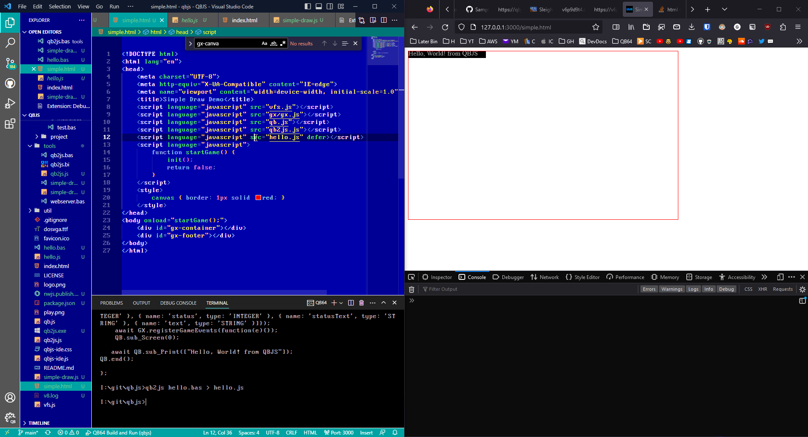
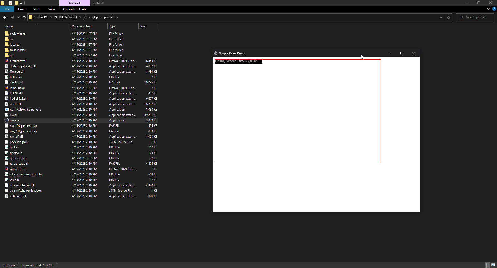

# QBJS Visual Studio Code Setup

## Resources

- [QBJS](https://qbjs.org) **Web IDE** - Everything QBJS in one location: web editor, file manager, and browser app.
- [QBJS GitHub](https://github.com/boxgaming/qbjs) Repo - More information about QBJS and source here.
- [QBJS Docs](https://github.com/boxgaming/qbjs/wiki) Wiki - Documentation for QBJS
- [NWJS Docs](https://nwjs.readthedocs.io/en/latest/) - Documentation for NWJS on Read The Docs
- [NWJS GitHub](https://github.com/nwjs/nw.js) - Repo for NWJS source here.
- [QB64 GitHub](https://github.com/QB64-Phoenix-Edition/QB64pe) - QB64 Phoenix Edition repo and source here. (NEEDED TO BUILD qb2js Transpiler)

# This profile uses the following extensions:
- [Debugger for NWJS](https://marketplace.visualstudio.com/items?itemName=ruakr.vsc-nwjs)
- [NWJS Snippets](https://marketplace.visualstudio.com/items?itemName=ssnangua.vscode-nwjs-snippets)
- [Live Preview](https://marketplace.visualstudio.com/items?itemName=ms-vscode.live-server)
- [QB64](https://github.com/QB64Official/vscode)

# How does this profile work and what does it do?

This profile makes the QBJS development experience as friendly and native for VSCode users as possible by:
- Using a QBasic inspired color theme and syntax highlighting.
- Installing language support extension for QB64
- Using Live Preview server for local HTML/JS/CSS work
- Export to NWJS for native application version for Windows, Mac, and Linux.

> Example showing Live Preview working side by side with VScode (you can also do this without leaving vscode)


> Example showing native Windows application running thanks to NWJS export


## About NWJS
NWJS will create a binary package for Windows, Linux, and MacOS that will have a native application window and load your HTML and QBJS code into.

## About Live Preview
Live Preview you can use while you build your project. Open HTML file, then click the preview icon in the top right. Also, once you are in preview mode, you can copy and paste the URL from the Live Preview pane into a real browser if you prefer. Any edits you make to the index.html file will auto-refresh.

# SETUP

## Install QB64 PE
1. Go to QB64 PE GitHub Releases page
2. Download the latest version
3. Unzip it to where you want
4. The directory where you unzip will be referenced when you install the QB64 extension, as next step.

## Install QB64 Extension
> This extension needs to be installed manually because it has not yet been published to the vscode extension marketplace.
1. Type `CTRL-SHIFT-P`
2. Type "Extensions: Install from VSIX"
3. Locate `qb64-0.8.7.vsix`
4. Install it
5. In extensions pane, refresh them with little arrow icon
6. Select QB64 extension
7. From gear icon on extension tile choose Extension Settings
8. Set your settings, and the path to your QB64 installation
9. If you are using QB64pe you will need to create an alias or symlink or copy of the QB64pe.exe as QB64.exe

## Start fresh
> Launch vscode and close any existing workspaces, and folders.

## A. Import profile
1. Import the `QBJS.code-profile` from this repo from vscode gear menu in action bar bottom left.
2. After import, switch to QBJS profile in vscode


## B. Setting up workspace
3. Create a new directory
4. Copy `./project-template` files into the new directory
5. Copy qb2js.exe (or other binary see below) to new directory
6. Open new directory as workspace root in vscode
7. Press `CTRL+SHIFT+P` and type `NWJS Install`

## C. Testing workspace
8. Open main.bas
9. Edit it to say "this works!" instead of "Hello world!.."
10. Transpile it using Terminal -> Run Task -> Compile QB2JS
11. Open index.html
12. Press `CTRL+SHIFT+P` and tyep `NWJS Publish`
13. New `publish` directory was made, right click on it and choose Reveal in Explorer
14. Run `nw.exe` to test

# Quick Publish (F5)
> Use hotkey F5 to publish quickly, which will: remove any existing publish directory, transpile the main.bas to main.js, publish NWJS, run nw.exe for you.

---

# To build qb2js

## 1. Clone QBJS
```
gh repo clone boxgaming/qbjs
```

## 2. Building the QBJS qb2js Transpiler
```
Open tools\qb2js.bas
Compile using QB64
Outputs qb2js binary (tools\qb2js.exe or tools\qb2js (Mac/Linux))
Copy tools\qb2js (binary) to main workspace root
```

---

# To install icon conversion tools
```
npm install -g png-to-ico winresourcer
```

## To use icon conversion tool
```
png-to-ico qbjs-logo.png > qbjs-icon.ico
winresourcer --operation=Update --exeFile=nw.exe --resourceType=Icongroup --resourceName=IDR_MAINFRAME --lang=1033 --resourceFile=qbjs-icon.ico
```